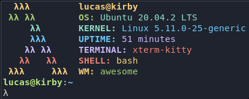
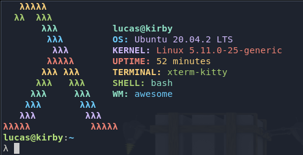

# Lambda Fetch

This script is pretty much a copy of **ufetch**:\
https://gitlab.com/jschx/ufetch

The difference is that instead of a distro's logo, I wanted to draw a lambda
made of smaller lambdas.

## Installation

Just download the `lambda-fetch` script and try to run it.

You might have to add executable permission to it with chmod:
```sh
sudo chmod 775 lambda-fetch
```

## Usage

After giving the executable permission, just run the script:
```sh
./lambda-fetch
```

You can pass the `-b` flag to it to make it big:
```sh
./lambda-fetch -b
```

## Screenshots
Small lambda:\


Big lambda:\


## Credits

All credits go to ufetch. All I did was a very simple lambda ASCII art.
